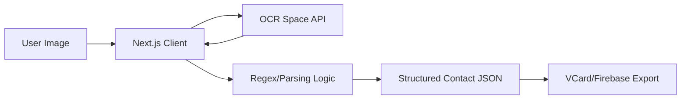

# 📇 scan2contact: Smart OCR Contact Extractor
**From Paper to Digital in a Single Scan**

**scan2contact** is a modern Next.js application that leverages OCR technology to surgically extract contact details from business cards or physical images and convert them into structured digital contacts.

`✅ Smart OCR Extraction | ✅ Next.js Serverless | ✅ MIT Licensed | ✅ VCard/Firebase Export`

## 🏗 Architecture
The application uses a serverless Next.js architecture, delegating heavy OCR lifting to external providers while managing state locally.

### Core Components
- **Frontend (`app/`)**: Modern React components for image upload, preview, and results rendering.
- **OCR Logic (`lib/ocr.ts`)**: Surgical integration with OCR.Space API for high-accuracy text extraction.
- **Parsing Engine**: Intelligent regex-based logic to identify names, emails, and phone numbers from raw OCR text.
- **Persistence Layer**: Firebase integration for storing and syncing extracted contacts across devices.

## 🔧 Setup Instructions

### 1. Environment Variables

You need to provide an OCR API key for the app to function:

#### Option A: Export via shell

`export OCR_SPACE_API_KEY="your_api_key_here"`

Option B: Use a .env file

Create a .env file in the root directory and add:

`OCR_SPACE_API_KEY=your_api_key_here`

2. Firebase Configuration

Update the Firebase-related environment variables as per the credentials provided. You can place them in the same lib/firebase.t file.
🚀 Getting Started

Install dependencies and start the development server:

`npm install       # Install all dependencies`

`npm run dev       # Start the development server`

Open your browser and navigate to:

http://localhost:3000/
