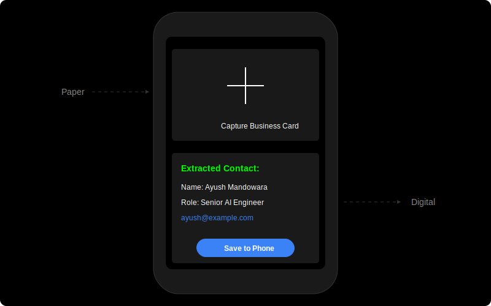
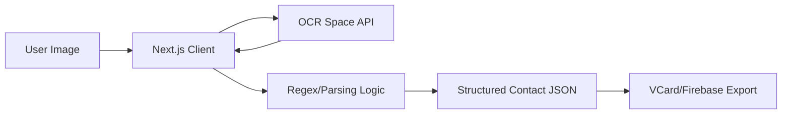

# 📇 scan2contact: Smart OCR Contact Extractor
**From Paper to Digital in a Single Scan**

[](https://github.com/google/gemini-cli)
[](https://nextjs.org/)
[](https://ocr.space/)

**scan2contact** is a modern Next.js application that leverages OCR technology to surgically extract contact details from business cards or physical images and convert them into structured digital contacts.

`✅ Smart OCR Extraction | ✅ Next.js Serverless | ✅ MIT Licensed | ✅ VCard/Firebase Export`

## 🎬 UI Preview


## 🏗 Architecture
The application uses a serverless Next.js architecture, delegating heavy OCR lifting to external providers while managing state locally.



### Core Components
- **Frontend (`app/`)**: Modern React components for image upload, camera preview, and results rendering.
- **OCR Logic (`lib/ocr.ts`)**: Surgical integration with OCR.Space API for text extraction.
- **Parsing Engine**: Intelligent regex-based logic to identify names, emails, and phone numbers.
- **Persistence**: Firebase integration for storing and syncing extracted contacts.

## 🚀 Getting Started

1. **Environment Variables**:
   Create a `.env` file:
   ```env
   OCR_SPACE_API_KEY=your_key
   ```

2. **Install & Run**:
   ```bash
   npm install
   npm run dev
   ```

## 📜 License
This project is licensed under the **MIT License** - see the [LICENSE](LICENSE) file for details.

---
*Built with ❤️ for Digital Networking.*
